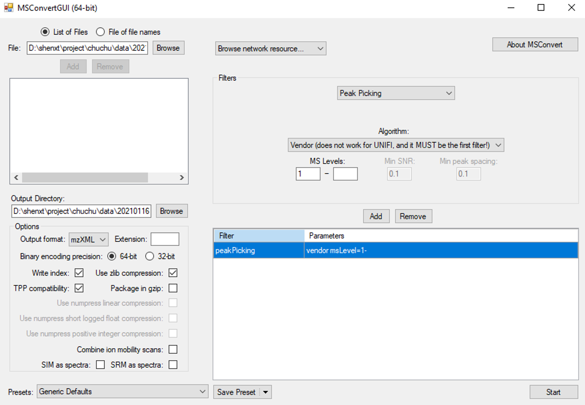
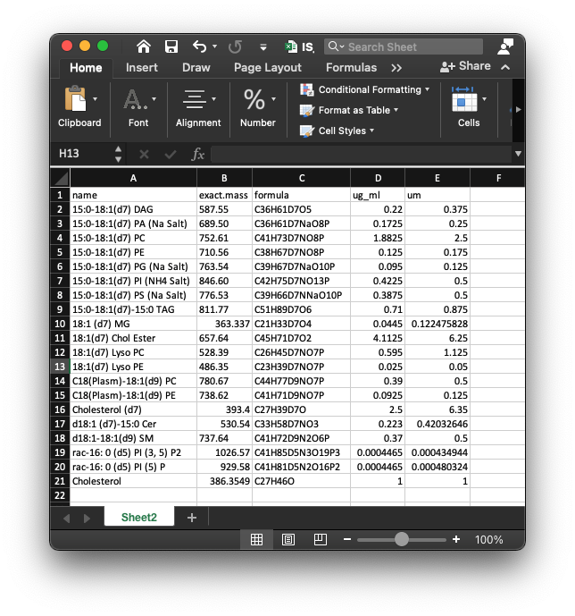

```{r, include=FALSE}
knitr::opts_chunk$set(
  collapse = TRUE,
  comment = "#>",
  out.width = "100%"
)
```

***

# **Data organization**

## **Convert raw data to mzXML data**

The raw lipidomics data should be transfered to mzXML format files using [ProteoWizard software](http://proteowizard.sourceforge.net/). The parameter setting should be set as below figure shows:



## **Put mzXML data into a folder**

Then create a folder, and create "POS" and "NEG" folders, and then put all the mzMXL data in the folders according to groups.


## **Internal standard information**

To do absolute quantification, you need to provide the information of internal standard in samples. The data should be "xlsx" format, and like the below shows:



And then put the internal standard informations in "POS" and "NEG" folder respectively.

## **Lipid identification information**

The lipid identification table can be from any other software, for example, here we use the `lipidSearch` software, and then put the lipid identification table for positive and negative mode in "POS" and "NEG" folder respectively. 

The lipid identification table from `lipidSearch` is like the below figure shows:


# **Run `get_lipid_absolute_quantification()`**

Then we can run `get_lipid_absolute_quantification()` function to get the absolute quantification table of lipids.

```{r, eval = FALSE, warning = FALSE}
get_lipid_absolute_quantification(
  path = path,
  is_info_name_pos = is_info_name_pos,
  is_info_name_neg = is_info_name_neg,
  use_manual_is_info = use_manual_is_info,
  lipid_annotation_table_pos = lipid_annotation_table_pos,
  lipid_annotation_table_neg = lipid_annotation_table_neg,
  chol_rt = chol_rt,
  output_integrate = output_integrate,
  forced_targeted_peak_table_name = forced_targeted_peak_table_name,
  fit.gaussian = fit.gaussian,
  integrate_xcms = integrate_xcms,
  output_eic = output_eic,
  ppm = ppm,
  rt.tolerance = rt.tolerance,
  threads = threads,
  rerun = rerun,
  which_group_for_rt_confirm = which_group_for_rt_confirm,
  match_item_pos = match_item_pos,
  match_item_neg = match_item_neg
)
```

All the parameters:

* path: working directory.

* is_info_name_pos & is_info_name_neg: the names of internal standard information (xlsx format), they should be in "POS" and "NEG" folder, respectively.

* use_manual_is_info: If you have know the adduct and retention time of the internal standards, you can put them in the internal standard information and then set this as TRUE.


* lipid_annotation_table_pos & lipid_annotation_table_neg: lipid identification tables from other software (xlsx format), they should be in "POS" and "NEG" folder, respectively.

* output_eic: Output EIC or not.

* ppm: Peak detection ppm.

* rt.tolerance: Peak detection RT tolerance.

* threads: Number of cores.

* rerun: Rerun or not.

* which_group_for_rt_confirm: From which group to find the RTs of all the internal standards.

* match_item_pos & match_item_neg: The lipid group and internal standard matching table. It is a list. For example:   
list(
    "Cer" = "d18:1 (d7)-15:0 Cer",
    "ChE" = c("18:1(d7) Chol Ester", "Cholesterol (d7)"),
    "Chol" = "Cholesterol (d7)",
    "DG" = "15:0-18:1(d7) DAG",
    "LPC" = "18:1(d7) Lyso PC",
    "LPE" = "18:1(d7) Lyso PE",
    "MG" = "18:1 (d7) MG",
    "PA" = "15:0-18:1(d7) PA (Na Salt)",
    "PC" = "15:0-18:1(d7) PC",
    "PE" = "15:0-18:1(d7) PE",
    "PG" = "15:0-18:1(d7) PG (Na Salt)",
    "PI" = "15:0-18:1(d7) PI (NH4 Salt)",
    "PPE" = "C18(Plasm)-18:1(d9) PE",
    "PS" = "15:0-18:1(d7) PS (Na Salt)",
    "SM" = "d18:1-18:1(d9) SM",
    "TG" = "15:0-18:1(d7)-15:0 TAG"
  )


# **Demo data to show how to use `lipidflow`**

## **Organize demo data**

```{r, eval=FALSE, warning=TRUE, cache=TRUE}
library(lipidflow)
library(tidyverse)

pos_data = system.file("POS", package = "lipidflow")
neg_data = system.file("NEG", package = "lipidflow")
path = file.path(".", "example")
dir.create(path)
file.copy(from = pos_data, to = path, recursive = TRUE, overwrite = TRUE)
file.copy(from = neg_data, to = path, recursive = TRUE, overwrite = TRUE)
setwd(path)
```

```{r, eval=TRUE, warning=TRUE, cache=TRUE}
match_item_pos =
  list(
    "Cer" = "d18:1 (d7)-15:0 Cer",
    "ChE" = c("18:1(d7) Chol Ester", "Cholesterol (d7)"),
    "Chol" = "Cholesterol (d7)",
    "DG" = "15:0-18:1(d7) DAG",
    "LPC" = "18:1(d7) Lyso PC",
    "LPE" = "18:1(d7) Lyso PE",
    "MG" = "18:1 (d7) MG",
    "PA" = "15:0-18:1(d7) PA (Na Salt)",
    "PC" = "15:0-18:1(d7) PC",
    "PE" = "15:0-18:1(d7) PE",
    "PG" = "15:0-18:1(d7) PG (Na Salt)",
    "PI" = "15:0-18:1(d7) PI (NH4 Salt)",
    "PPE" = "C18(Plasm)-18:1(d9) PE",
    "PS" = "15:0-18:1(d7) PS (Na Salt)",
    "SM" = "d18:1-18:1(d9) SM",
    "TG" = "15:0-18:1(d7)-15:0 TAG"
  )
```

```{r, eval=TRUE, warning=TRUE, cache=TRUE}
match_item_neg =
  list(
    "Cer" = "d18:1 (d7)-15:0 Cer",
    "Chol" = "Cholesterol (d7)",
    "ChE" = c("18:1(d7) Chol Ester", "Cholesterol (d7)"),
    "LPC" = "18:1(d7) Lyso PC",
    "LPE" = "18:1(d7) Lyso PE",
    "PC" = "15:0-18:1(d7) PC",
    "PE" = "15:0-18:1(d7) PE",
    "PG" = "15:0-18:1(d7) PG (Na Salt)",
    "PI" = "15:0-18:1(d7) PI (NH4 Salt)",
    "PPE" = "C18(Plasm)-18:1(d9) PE",
    "PS" = "15:0-18:1(d7) PS (Na Salt)",
    "SM" = "d18:1-18:1(d9) SM"
  )
```

```{r, eval=FALSE, warning=TRUE, cache=TRUE}
get_lipid_absolute_quantification(
  path = ".",
  is_info_name_pos = "IS_information.xlsx",
  is_info_name_neg = "IS_information.xlsx",
  use_manual_is_info = FALSE,
  lipid_annotation_table_pos = "lipid_annotation_table_pos.xlsx",
  lipid_annotation_table_neg = "lipid_annotation_table_neg.xlsx",
  output_eic = TRUE,
  ppm = 40,
  rt.tolerance = 180,
  threads = 3,
  rerun = FALSE,
  which_group_for_rt_confirm = "D25",
  match_item_pos = match_item_pos,
  match_item_neg = match_item_neg
)
```

# **Output result**

# **Manually check RTs of internal standards**

The RTs of internal standards are generated automatically, so some maybe not correct, you can open the EICs of each internal standard and then check the RTs and then put all the correct RTs, adducts and mzs of internal standards in your IS information table. 


