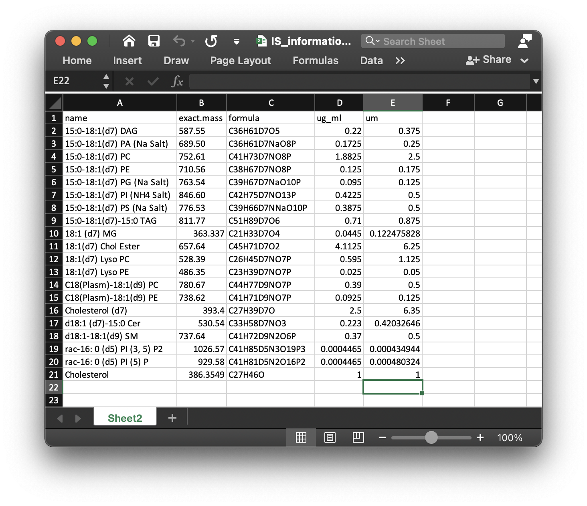

```{r, include=FALSE}
knitr::opts_chunk$set(
  collapse = TRUE,
  comment = "#>",
  out.width = "100%"
)
```

***

# **Get retention time of internal standards**

First, we need to get the retention time (RTs) of internal standards in samples. Here we also use the demo data from `lipidflow` package to show how to use.

## **Data preparation**

```{r, eval=TRUE, warning=FALSE, cache=TRUE}
library(lipidflow)
library(tidyverse)
pos_data = system.file("POS", package = "lipidflow")
neg_data = system.file("NEG", package = "lipidflow")
path = file.path(".", "example")
dir.create(path)
file.copy(from = pos_data, to = path, recursive = TRUE, overwrite = TRUE)
file.copy(from = neg_data, to = path, recursive = TRUE, overwrite = TRUE)
```

Now there will be a `example` folder in your work directory. And in the `example` folder, there are two folders: `POS` and `NEG`. The are two groups for each mode: "D25" and "M19". And each group has two repeats.


We then use the `get_IS_RT()` function to extract the peaks for each internal standard in samples.

## **Extract internal standards**

We need to extract internal standards for positive and negative mode, respectively. 

### **1. Positive mode**

We need to choose which class samples are used to extract internal standards. Here we use `D25`, so we set path as `POS/D25`. We also need the internal standard information (xlsx format), here is `IS_information.xlsx` in `POS` and `NEG` folders. It should be like the below figure shows:


There are five columns in this table: 

1. name: the name of internal standards.

2. exact.mass: Exact mass.

3. formula: Formula of internal standards.

4. ug_ml: Concentration (ug/ul) in samples for each internal standard.

5. um: Concentration (um) in samples for each internal standard.

Read the internal information table (is_info_table);

```{r, eval=TRUE, warning=FALSE, cache=TRUE}
is_info_table_pos =
  readxl::read_xlsx("example/POS/IS_information.xlsx")
```

Then we run `get_IS_RT()` function to extract internal standards in `POS/D25` group. 

```{r, eval=TRUE, warning=FALSE, cache=TRUE}
is_info_table_new_pos = 
get_IS_RT(
  path = "example/POS/D25",
  is_info_table = is_info_table_pos,
  polarity = "positive",
  threads = 3,
  rerun = TRUE,
  output_eic = TRUE
)
```

The parameters of `get_IS_RT()`:

1. `path`: The folder contains `D25` samples.

2. `is_info_table`: The internal standard information.

3. `polarity`: "positive" or "negative".

4. `threads`: The number of cores to run.

5. `rerun`: If you set `rerun` as `FALSE`, then the peak detection will nor be rerun. 

6. `output_eic`: Output EIC or not.

The `is_info_table_new_pos` is the table which has been added the information of internal standards:

```{r, eval=TRUE, warning=FALSE, cache=TRUE}
head(is_info_table_new_pos)
```

We then output the table into local folder:

```{r, eval=TRUE, warning=FALSE, cache=TRUE}
openxlsx::write.xlsx(
  is_info_table_new_pos,
  file = "example/POS/IS_info_new.xlsx",
  asTable = TRUE
)
```

### **2. Negative mode**

Negative mode is same with positive mode.

```{r, eval=TRUE, warning=FALSE, cache=TRUE}
is_info_table_neg =
  readxl::read_xlsx("example/NEG/IS_information.xlsx")

is_info_table_new_neg = 
get_IS_RT(
  path = "example/NEG/D25",
  is_info_table = is_info_table_neg,
  polarity = "negative",
  threads = 3,
  rerun = TRUE,
  output_eic = TRUE
)

openxlsx::write.xlsx(
  is_info_table_new_neg,
  file = "example/NEG/IS_info_new.xlsx",
  asTable = TRUE
)
```


## **Next step**

Next we need to get the relative quantification data of all internal standards in all sample. Please click here: [Get relative quantification data](https://jaspershen.github.io/lipidflow/articles/is_relative_quantification.html)