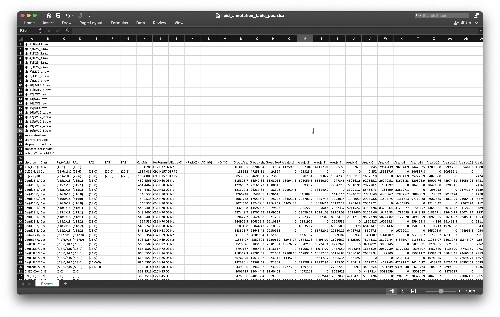

```{r, include=FALSE}
knitr::opts_chunk$set(
  collapse = TRUE,
  comment = "#>",
  out.width = "100%"
)
```

***

This step is used to get the relative quantification data of internal standards and lipids in all samples. If you have not finished the previous step, please click here: 

[Get retention time of internal standards](https://jaspershen.github.io/lipidflow/articles/get_is_retention_time.html). 

If you have finished this step, click here to next step: 

[Absolute quantification](https://jaspershen.github.io/lipidflow/articles/absolute_quantification.html).

***

# **Get relative quantification**

We should have finished [step 1](https://jaspershen.github.io/lipidflow/articles/get_is_retention_time.html). Then we combine the internal standard information from positive and negative mode.

***

## **Combine internal standard information from positive and negative mode**

```{r, eval=TRUE, warning=FALSE, message=FALSE, cache=FALSE}
library(lipidflow)
library(tidyverse)
library(openxlsx)
```

```{r, eval=TRUE, warning=FALSE, message=FALSE, cache=FALSE}
is_info_table_new_pos = 
  readxl::read_xlsx("example/POS/IS_info_new.xlsx")

is_info_table_new_neg = 
  readxl::read_xlsx("example/NEG/IS_info_new.xlsx")

is_info_table_new =
  is_info_table_new_pos %>%
  dplyr::left_join(is_info_table_new_neg[, c("name", "rt_neg_second", "rt_neg_min", "adduct_neg", "mz_neg")],
                   by = "name")
```

```{r, eval=TRUE, warning=FALSE, message=FALSE, cache=FALSE}
head(is_info_table_new)
```

Then we output the `is_info_table_new` into the `example/Result` folder.

We first create a folder named as `Result`:

```{r, eval=TRUE, warning=FALSE, message=TRUE, cache=FALSE}
dir.create("example/Result")
```

```{r, eval=TRUE, warning=FALSE, message=TRUE, cache=FALSE}
dir.create("example/Result")
openxlsx::write.xlsx(is_info_table_new,
                     file = "example/Result/IS_info_table.xlsx")
```
    
***
    
## **Relative quantification**

### **1. Positive mode**

We need to get the sample information of samples first. 

```{r, eval=TRUE, warning=FALSE, message=TRUE, cache=FALSE}
sample_info_pos =
  generate_sample_info(path = "example/POS")
```

```{r, eval=TRUE, warning=FALSE, message=TRUE, cache=FALSE}
head(sample_info_pos)
```

Get the Cholesterol retention time:

```{r, eval=TRUE, warning=FALSE, cache=FALSE}
if (any(is_info_table_new$name == "Cholesterol")) {
  idx = which(is_info_table_new$name == "Cholesterol")
  chol_rt2 = c(is_info_table_new$rt_pos_second[idx],
               is_info_table_new$rt_neg_second[idx])
  chol_rt2 = chol_rt2[!is.na(chol_rt2)]
  if (length(chol_rt2) > 0) {
    chol_rt = chol_rt2[1]
  }
} else{
  chol_rt = 1169
}
```

```{r, eval=TRUE, warning=FALSE, cache=FALSE}
chol_rt
```

#### **Internal standards**

Then run `get_relative_quantification()` for internal standards:

```{r, eval=TRUE, warning=FALSE, cache=TRUE}
get_relative_quantification(
  path = "example/POS",
  output_path_name = "is_relative_quantification",
  targeted_table_name = "IS_info_new.xlsx",
  sample_info = sample_info_pos,
  targeted_table_type = "is",
  polarity = "positive",
  chol_rt = chol_rt,
  output_integrate = TRUE,
  forced_targeted_peak_table_name = NULL,
  fit.gaussian = TRUE,
  integrate_xcms = TRUE,
  output_eic = TRUE,
  ppm = 40,
  rt.tolerance = 180,
  threads = 5,
  rerun = FALSE
)
```

** The meanings of all parameters:**

1. `path`: Work directory.

2. `output_path_name`: The folder name which you want to ouput result.

3. `targeted_table_name`: The name of internal standard information.

4. `sample_info`: sample information of samples.

5. `targeted_table_type`: The type of extracted peaks, "is" (internal standard) or "lipid" (lipids).

6. `polarity`: "positive" or `negative`.

7. `chol_rt`: Cholesterol retention time (second).

8. `output_integrate`: output_integrate.

9. `output_eic`: Output EICs of peaks or not.

10. `ppm`: peak detection ppm.

11. `rt.tolerance`: peak detection retention time tolerance (second).

12. `threads`: Number of cores to run.

13. `rerun`: Rerun peak detction or not.

Then all the results are outputted into a folder named as `example/POS/is_relative_quantification`. The relative quantification table is `is_quantification_table.xlsx` and all the peak shapes are in `peak_shape`.

`is_quantification_table.xlsx` is:


One example of peak shape (15_0-18_1(d7) PC):

Rectangle region means the integrate of peak region. 

```{r, echo=FALSE, eval=TRUE}
htmltools::tags$iframe(
  title = "Internal standard",
  src = "../man/figures/15_0_18_1_d7_PC.html",
  width = "100%",
  height = "600",
  scrolling = "no",
  seamless = "seamless",
  frameBorder = "0"
)
```

#### **Lipids**

Then run `get_relative_quantification()` for lipids:

```{r, eval=TRUE, warning=FALSE, cache=TRUE}
get_relative_quantification(
  path = "example/POS",
  output_path_name = "lipid_relative_quantification",
  targeted_table_name = "lipid_annotation_table_pos.xlsx",
  sample_info = sample_info_pos,
  targeted_table_type = "lipid",
  polarity = "positive",
  chol_rt = chol_rt,
  output_integrate = TRUE,
  forced_targeted_peak_table_name = NULL,
  fit.gaussian = TRUE,
  integrate_xcms = TRUE,
  output_eic = TRUE,
  ppm = 40,
  rt.tolerance = 180,
  threads = 5,
  rerun = FALSE
)
```

Here the `targeted_table_name` is the annotation table from `lipidsearch`. It should be placed in `POS` and `NEG` folders, respectively.



The results are outputted in `example/POS/lipid_relative_quantification` folder. These results are similar with internal standards.

### **2. Negative mode**

Negative mode is same with positive mode.

```{r, eval=TRUE, warning=FALSE, message=TRUE, cache=FALSE}
sample_info_neg =
  generate_sample_info(path = "example/NEG")
```

#### **Internal standards**

```{r, eval=TRUE, warning=FALSE, cache=TRUE}
get_relative_quantification(
  path = "example/NEG",
  output_path_name = "is_relative_quantification",
  targeted_table_name = "IS_info_new.xlsx",
  sample_info = sample_info_neg,
  targeted_table_type = "is",
  polarity = "negative",
  chol_rt = chol_rt,
  output_integrate = TRUE,
  forced_targeted_peak_table_name = NULL,
  fit.gaussian = TRUE,
  integrate_xcms = TRUE,
  output_eic = TRUE,
  ppm = 40,
  rt.tolerance = 180,
  threads = 5,
  rerun = FALSE
)
```

#### **Lipids**

Then run `get_relative_quantification()` for lipids:

```{r, eval=TRUE, warning=FALSE, cache=TRUE}
get_relative_quantification(
  path = "example/NEG",
  output_path_name = "lipid_relative_quantification",
  targeted_table_name = "lipid_annotation_table_neg.xlsx",
  sample_info = sample_info_neg,
  targeted_table_type = "lipid",
  polarity = "negative",
  chol_rt = chol_rt,
  output_integrate = TRUE,
  forced_targeted_peak_table_name = NULL,
  fit.gaussian = TRUE,
  integrate_xcms = TRUE,
  output_eic = TRUE,
  ppm = 40,
  rt.tolerance = 180,
  threads = 5,
  rerun = FALSE
)
```

***

## **Next step**

Next we need to get the absolute quantification data of all lipids in all sample. 

Please click here: 

[Get absolute quantification data](https://jaspershen.github.io/lipidflow/articles/absolute_quantification.html)