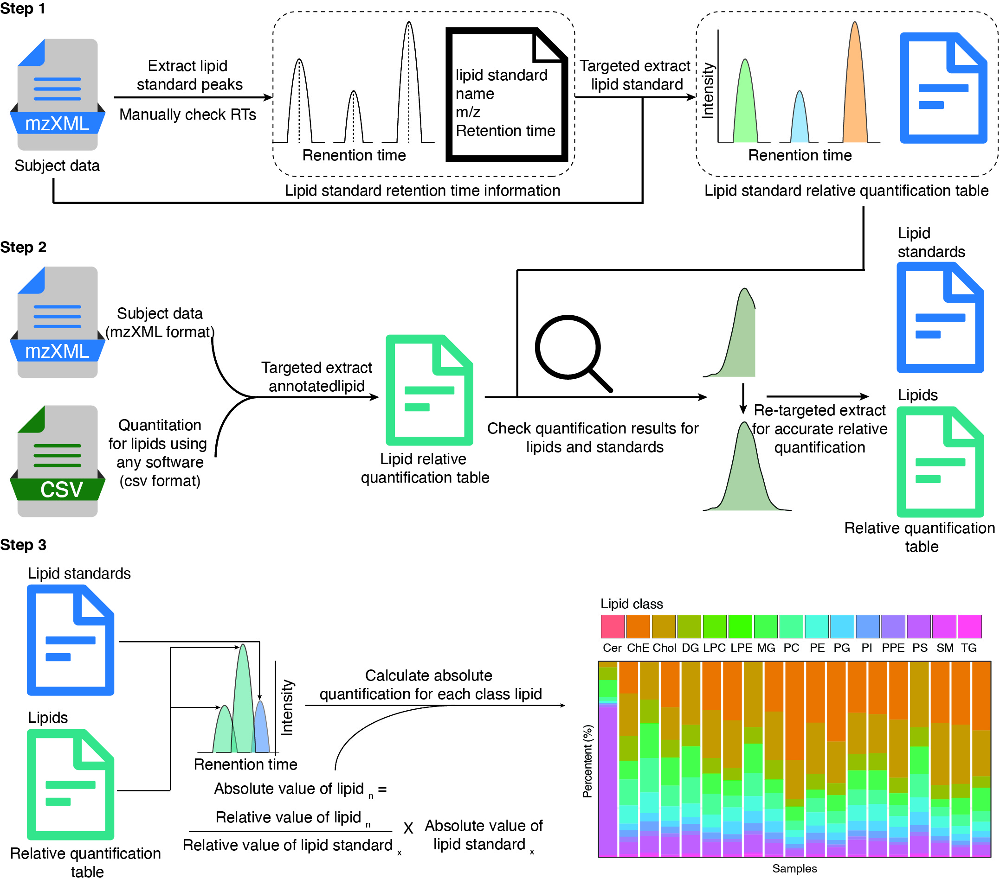

```{r, include=FALSE}
knitr::opts_chunk$set(
  collapse = TRUE,
  comment = "#>",
  out.width = "100%"
)
```

***

# **Introduction & Installation**

## **Introduction**

`lipidflow` is used for lipid absolute quantification. 


## **Installation**

You can install `lipidflow` from
[Github](https://github.com/jaspershen/lipidflow).

```{r, eval=FALSE, warning=FALSE, cache=FALSE}
if(!require(devtools)){
install.packages("devtools")
}
devtools::install_github("jaspershen/lipidflow")
```

`lipidflow` is a part of `tidymass`, so you can also install it by [`tidymass`](https://jaspershen.github.io/tidymass/index.html).

***

# **Workflow of `lipidflow`**



***

## **Step1: Get the retention time of internal standards**

The first step is to extract the extracted ion chromatogram (EIC) of all internal standards (IS) in samples and then get the retention times (RTs), adduct and m/z of all the internal standards. 

***

## **Step 2: Get relative quantification data**

In this step, we will get the relative quantification data of internal standards and lipids.

***

## **Step 3: Get absolute quantification data**

In this step, we will get the absolute quantification data for lipids. The absolute quantification value for each lipid is calculated as:

$$ AI_i = \frac{RI_{i}AI_j}{RI_j} $$

Here, $AI_i$ is the absolute intensity of $i^{th}$ lipid. $RI_{i}$ is the relative intensity of $i^{th}$ lipid. $AI_i$ is the absolute intensity of $j^{th}$ internal standard. $RI_i$ is the absolute intensity of $j^{th}$ internal standard. 

So for each lipid, we need a corresponding internal standard for absolute quantification. In our demo data, for each class of lipids, we usually use one or two internal standard for absolute quantification.

***

## **Step 4: Output and organize results**

In this step, we output some result and organize them so make them easier for manually check. 
