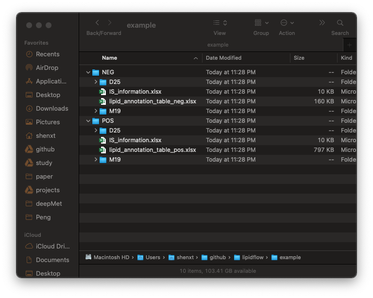
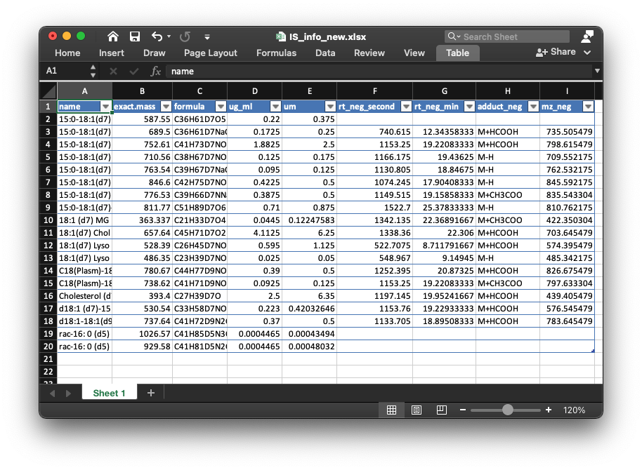
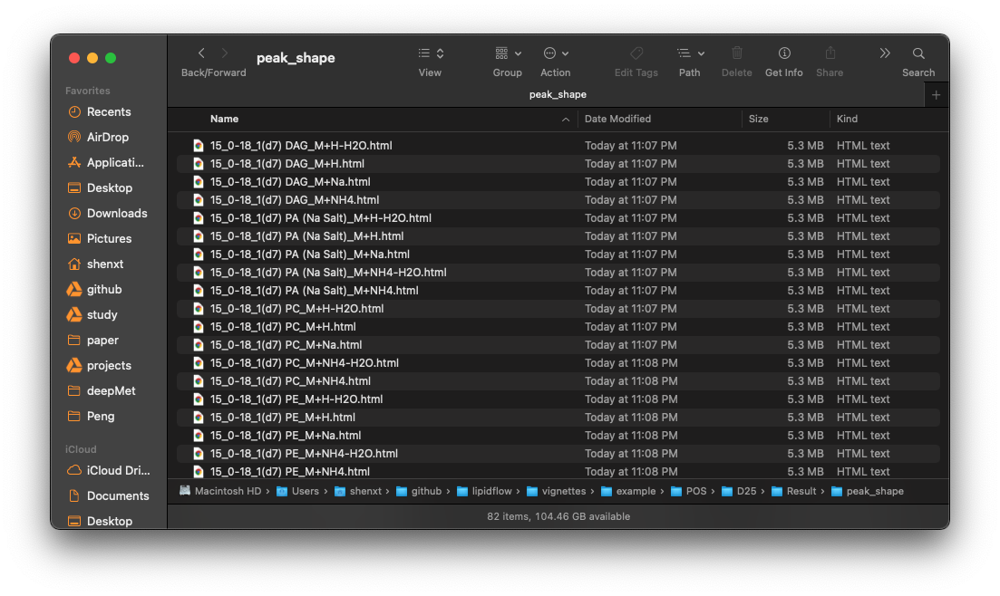

```{r, include=FALSE}
knitr::opts_chunk$set(
  collapse = TRUE,
  comment = "#>",
  out.width = "100%"
)
```

***

# **Demo data to show how to use `lipidflow`**

Here we use the demo data in `lipidflow` to show how to use it for lipid absolute quantification.

## **Organize the demo data**

First, we need to get the demo dataset.

```{r, eval=FALSE, warning=FALSE, cache=TRUE}
library(lipidflow)
library(tidyverse)
pos_data = system.file("POS", package = "lipidflow")
neg_data = system.file("NEG", package = "lipidflow")
path = file.path(".", "example")
dir.create(path)
file.copy(from = pos_data, to = path, recursive = TRUE, overwrite = TRUE)
file.copy(from = neg_data, to = path, recursive = TRUE, overwrite = TRUE)
```

Now there will be a `example` folder in your work directory. And in the `example` folder, there are two folders: `POS` and `NEG`. The are two groups for each mode: "D25" and "M19". And each group has two repeats.



Next, we should set the match list between internal standards and lipid class.

* Positive mode:

```{r, eval=FALSE, warning=FALSE, cache=TRUE}
match_item_pos =
  list(
    "Cer" = "d18:1 (d7)-15:0 Cer",
    "ChE" = c("18:1(d7) Chol Ester", "Cholesterol (d7)"),
    "Chol" = "Cholesterol (d7)",
    "DG" = "15:0-18:1(d7) DAG",
    "LPC" = "18:1(d7) Lyso PC",
    "LPE" = "18:1(d7) Lyso PE",
    "MG" = "18:1 (d7) MG",
    "PA" = "15:0-18:1(d7) PA (Na Salt)",
    "PC" = "15:0-18:1(d7) PC",
    "PE" = "15:0-18:1(d7) PE",
    "PG" = "15:0-18:1(d7) PG (Na Salt)",
    "PI" = "15:0-18:1(d7) PI (NH4 Salt)",
    "PPE" = "C18(Plasm)-18:1(d9) PE",
    "PS" = "15:0-18:1(d7) PS (Na Salt)",
    "SM" = "d18:1-18:1(d9) SM",
    "TG" = "15:0-18:1(d7)-15:0 TAG"
  )
```

* Negative mode:

```{r, eval=FALSE, warning=FALSE, cache=TRUE}
match_item_neg =
  list(
    "Cer" = "d18:1 (d7)-15:0 Cer",
    "Chol" = "Cholesterol (d7)",
    "ChE" = c("18:1(d7) Chol Ester", "Cholesterol (d7)"),
    "LPC" = "18:1(d7) Lyso PC",
    "LPE" = "18:1(d7) Lyso PE",
    "PC" = "15:0-18:1(d7) PC",
    "PE" = "15:0-18:1(d7) PE",
    "PG" = "15:0-18:1(d7) PG (Na Salt)",
    "PI" = "15:0-18:1(d7) PI (NH4 Salt)",
    "PPE" = "C18(Plasm)-18:1(d9) PE",
    "PS" = "15:0-18:1(d7) PS (Na Salt)",
    "SM" = "d18:1-18:1(d9) SM"
  )
```

## **Run `get_lipid_absolute_quantification()` function**

Then we run `get_lipid_absolute_quantification()` function. Please note that `path` need to set as `example`.

```{r, eval=FALSE, warning=FALSE, error=FALSE, message=FALSE, cache=TRUE}
get_lipid_absolute_quantification(
  path = "example",
  is_info_name_pos = "IS_information.xlsx",
  is_info_name_neg = "IS_information.xlsx",
  use_manual_is_info = FALSE,
  lipid_annotation_table_pos = "lipid_annotation_table_pos.xlsx",
  lipid_annotation_table_neg = "lipid_annotation_table_neg.xlsx",
  output_eic = TRUE,
  ppm = 40,
  rt.tolerance = 180,
  threads = 3,
  rerun = FALSE,
  which_group_for_rt_confirm = "D25",
  match_item_pos = match_item_pos,
  match_item_neg = match_item_neg
)
```

# **Output result**

Most of the results are outputted in the `example/Result`, some results are in `example/POS` and `example/NEG`.

## **Information of internal standards**

Here we set `which_group_for_rt_confirm` as "D25", so this group samples will be used to extract internal standards and get the information of all internal standards.

The retention times of all internal standards are generated automatically, and outputted as `IS_info_pos.xlsx` in "example/POS" and `IS_info_neg.xlsx` in "example/NEG", respectively. 


We can see that `lipidflow` added the `rt_neg_second`, `rt_neg_min`, `adduct_neg` and `mz_neg` in the `IS_info_new.xlsx`. If there are no good EICs, no information for these internal standards.

Sometimes the information of internal standards maybe not correct, so you can open the EICs of each internal standard and then check the RTs and then put correct information in your IS information table. The EICs for each internal standard is in the `example/POS/Result/peak_shape` folder.



One example is like below figure shows:

```{r, echo=FALSE, eval=FALSE}
htmltools::tags$iframe(
  title = "Internal standard",
  src = "../man/figures/15_0-18_1d7_PA_Na_Salt_M+H.html",
  width = "100%",
  height = "600",
  scrolling = "no",
  seamless = "seamless",
  frameBorder = "0"
)
```

This is the EIC of `15_0-18_1(d7) PA (Na Salt)` with `M+H`. We can see that this internal `15_0-18_1(d7) PA (Na Salt)` has good peak shape and the retention time is around 800 second. 

If you find information of some internal standards are not correct, you can put the right information in `IS_info_new.xlsx` in `positive and negative `POS` and `NEG` folders, respectively. And then rerun the `get_lipid_absolute_quantification()` function, and set `is_info_name_pos` and `is_info_name_neg` as `IS_info_new.xlsx`, and `use_manual_is_info` as `TRUE`, then `lipidflow` will use the modified information table for next processing.

## **Final results for absolute quantification of lipids**

All the results for absolute quantification of lipids are in `example/Result`. 

