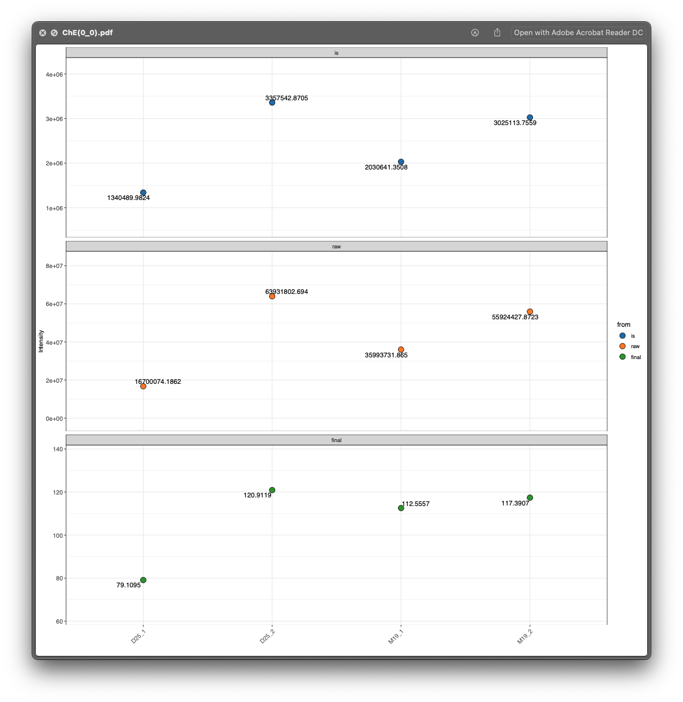

```{r, include=FALSE}
knitr::opts_chunk$set(
  collapse = TRUE,
  comment = "#>",
  out.width = "100%"
)
```

`lipidflow` also provide only one function `get_lipid_absolute_quantification()` to finish all steps (step 1-4).

***

# **Demo data to show how to use `get_lipid_absolute_quantification()`**

## **Organize the demo data**

First, we need to get the demo dataset.

```{r, eval=TRUE, warning=FALSE, cache=TRUE}
library(lipidflow)
library(tidyverse)
pos_data = system.file("POS", package = "lipidflow")
neg_data = system.file("NEG", package = "lipidflow")
path = file.path(".", "example")
dir.create(path)
file.copy(from = pos_data, to = path, recursive = TRUE, overwrite = TRUE)
file.copy(from = neg_data, to = path, recursive = TRUE, overwrite = TRUE)
```

Now there will be a `example` folder in your work directory. And in the `example` folder, there are two folders: `POS` and `NEG`. The are two groups for each mode: "D25" and "M19". And each group has two repeats.


Next, we should set the match list between internal standards and lipid class.

* Positive mode:

```{r, eval=TRUE, warning=FALSE, cache=TRUE}
match_item_pos =
  list(
    "Cer" = "d18:1 (d7)-15:0 Cer",
    "ChE" = c("18:1(d7) Chol Ester", "Cholesterol (d7)"),
    "Chol" = "Cholesterol (d7)",
    "DG" = "15:0-18:1(d7) DAG",
    "LPC" = "18:1(d7) Lyso PC",
    "LPE" = "18:1(d7) Lyso PE",
    "MG" = "18:1 (d7) MG",
    "PA" = "15:0-18:1(d7) PA (Na Salt)",
    "PC" = "15:0-18:1(d7) PC",
    "PE" = "15:0-18:1(d7) PE",
    "PG" = "15:0-18:1(d7) PG (Na Salt)",
    "PI" = "15:0-18:1(d7) PI (NH4 Salt)",
    "PPE" = "C18(Plasm)-18:1(d9) PE",
    "PS" = "15:0-18:1(d7) PS (Na Salt)",
    "SM" = "d18:1-18:1(d9) SM",
    "TG" = "15:0-18:1(d7)-15:0 TAG"
  )
```

* Negative mode:

```{r, eval=TRUE, warning=FALSE, cache=TRUE}
match_item_neg =
  list(
    "Cer" = "d18:1 (d7)-15:0 Cer",
    "Chol" = "Cholesterol (d7)",
    "ChE" = c("18:1(d7) Chol Ester", "Cholesterol (d7)"),
    "LPC" = "18:1(d7) Lyso PC",
    "LPE" = "18:1(d7) Lyso PE",
    "PC" = "15:0-18:1(d7) PC",
    "PE" = "15:0-18:1(d7) PE",
    "PG" = "15:0-18:1(d7) PG (Na Salt)",
    "PI" = "15:0-18:1(d7) PI (NH4 Salt)",
    "PPE" = "C18(Plasm)-18:1(d9) PE",
    "PS" = "15:0-18:1(d7) PS (Na Salt)",
    "SM" = "d18:1-18:1(d9) SM"
  )
```

## **Run `get_lipid_absolute_quantification()` function**

Then we run `get_lipid_absolute_quantification()` function. Please note that `path` need to set as `example`.

```{r, eval=TRUE, warning=FALSE, error=FALSE, message=FALSE, cache=TRUE}
get_lipid_absolute_quantification(
  path = "example",
  is_info_name_pos = "IS_information.xlsx",
  is_info_name_neg = "IS_information.xlsx",
  use_manual_is_info = FALSE,
  lipid_annotation_table_pos = "lipid_annotation_table_pos.xlsx",
  lipid_annotation_table_neg = "lipid_annotation_table_neg.xlsx",
  output_eic = TRUE,
  ppm = 40,
  rt.tolerance = 180,
  threads = 3,
  rerun = FALSE,
  which_group_for_rt_confirm = "D25",
  match_item_pos = match_item_pos,
  match_item_neg = match_item_neg
)
```

## **Manually check for relative quantification data of internal standards**

Sometimes, the peak detection maybe not accurate, so we need to manually check the peak shape of all the internal standards and then detect peak and integrate peak shape again.

For example, the internal standard 18_1_d7_ Lyso PC in positive mode (`example/POS/is_relative_quantification/peak_shape/18_1_d7_ Lyso PC.html`), the peak shape is like below figure shows:

```{r, echo=FALSE, eval=TRUE}
htmltools::tags$iframe(
  title = "Internal standard",
  src = "../man/figures/figure31.html",
  width = "100%",
  height = "600",
  scrolling = "no",
  seamless = "seamless",
  frameBorder = "0"
)
```


From this figure, we can see that for the samples `D25_1`, `D25_2` and `M19_2`, the integrate region (begin point) is not correct, so we need to manually correct that.

1. Open the table in `example/POS/is_relative_quantification/forced_targeted_peak_table_temple.xlsx`, like the below figure shows:


2. Then open the peak shape plot for each internal standard in `example/POS/is_relative_quantification/peak_shape`. Then if you find that the peak integration is not correct, you can add the right begin and end retention time for peaks like below video shows:

```{r, eval=TRUE, warning=FALSE, cache=FALSE, echo=FALSE}
library(vembedr)
embed_url("https://www.youtube.com/watch?v=OiUdqkw5KZc&feature=youtu.be") %>% 
  use_align("center") %>% 
  use_bs_responsive()
```

After check all the internal standards which are not normal, please rename it as `forced_targeted_peak_table_temple_manual.xlsx` and rerun `get_relative_quantification()`, and note that **set `forced_targeted_peak_table_name` as `forced_targeted_peak_table_temple_manual.xlsx`**:

**For the negative mode, we can also manually check internal standards like this and rerun to get more accurate peak integration and relative quantification data.**

## **Manually check for absolute quantification data of lipids**

### **Absolute quantification in class level**

First, please open the `example/Result/class_plot`, and check each plot. For example, for the lipid class `ChE`, we can see that `D25_1` and `D25_2` are in the sample groups, but their `ChE` are very different, so it indicates that the absolute quantification for `ChE` class may be wrong. So next we should check each lipid in `ChE`.


### **Absolute quantification in lipid level**

Then open the `example/Result/intensity_plot/ChE` folder, and there is only one `ChE` lipid `ChE(0_0)`:



From the `lipid_data_um.xlsx`, we know that `ChE(0_0)` is from positive mode, so we then open the `html` plot for `ChE(0_0)`, and we can clearly see that the peak integration for `D25_1` is wrong.

```{r, echo=FALSE, eval=TRUE}
htmltools::tags$iframe(
  title = "Internal standard",
  src = "../man/figures/figure35.html",
  width = "100%",
  height = "600",
  scrolling = "no",
  seamless = "seamless",
  frameBorder = "0"
)
```


## **Rerun `get_lipid_absolute_quantification()`**

Then we need to get the relative and absolute quantification data again.

First, open the `forced_targeted_peak_table_temple.xlsx` in `example/POS/lipid_relative_quantification` folder. And add the correct peak integration begin and end time into `forced_targeted_peak_table_temple.xlsx`, and rename it as `forced_targeted_peak_table_temple_manual.xlsx`. This step is same with [Manually check for relative quantification data of internal standards in step 2](file:///Users/shenxt/github/lipidflow/docs/articles/is_relative_quantification.html). Please check the video there.

Then run the `get_relative_quantification()` function for lipids.

```{r, eval=TRUE, warning=FALSE, cache=TRUE}
get_lipid_absolute_quantification(
  path = "example",
  forced_targeted_peak_table_name = "forced_targeted_peak_table_temple_manual.xlsx",
  is_info_name_pos = "IS_information.xlsx",
  is_info_name_neg = "IS_information.xlsx",
  lipid_annotation_table_pos = "lipid_annotation_table_pos.xlsx",
  lipid_annotation_table_neg = "lipid_annotation_table_neg.xlsx",
  output_eic = TRUE,
  ppm = 40,
  rt.tolerance = 180,
  threads = 3,
  rerun = FALSE,
  which_group_for_rt_confirm = "D25",
  match_item_pos = match_item_pos,
  match_item_neg = match_item_neg
)
```

Then open the peak shape for `ChE(0_0)`:

```{r, echo=FALSE, eval=TRUE}
htmltools::tags$iframe(
  title = "Internal standard",
  src = "../man/figures/figure37.html",
  width = "100%",
  height = "600",
  scrolling = "no",
  seamless = "seamless",
  frameBorder = "0"
)
```

Now it is correct.