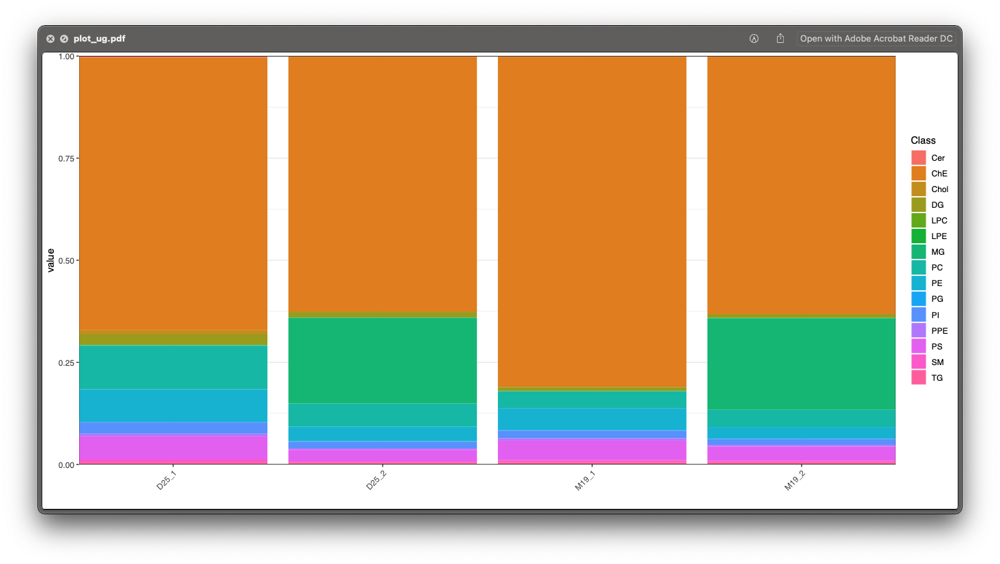

```{r, include=FALSE}
knitr::opts_chunk$set(
  collapse = TRUE,
  comment = "#>",
  out.width = "100%"
)
```

***

Then we need to output and organize some results. If you have not finished the previous step, please click here: 

[Step 3: get absolute quantification data](https://jaspershen.github.io/lipidflow/articles/absolute_quantification.html). 

***

# **Organize results**

Here we first organize the plots of lipids to different groups according to lipid class.

```{r, eval=TRUE, warning=FALSE, message=FALSE, cache=TRUE}
library(lipidflow)
library(tidyverse)
library(openxlsx)
```

***

## **Positive mode**

```{r, eval=TRUE, warning=FALSE, message=FALSE, cache=TRUE}
match_item_pos =
  list(
    "Cer" = "d18:1 (d7)-15:0 Cer",
    "ChE" = c("18:1(d7) Chol Ester", "Cholesterol (d7)"),
    "Chol" = "Cholesterol (d7)",
    "DG" = "15:0-18:1(d7) DAG",
    "LPC" = "18:1(d7) Lyso PC",
    "LPE" = "18:1(d7) Lyso PE",
    "MG" = "18:1 (d7) MG",
    "PA" = "15:0-18:1(d7) PA (Na Salt)",
    "PC" = "15:0-18:1(d7) PC",
    "PE" = "15:0-18:1(d7) PE",
    "PG" = "15:0-18:1(d7) PG (Na Salt)",
    "PI" = "15:0-18:1(d7) PI (NH4 Salt)",
    "PPE" = "C18(Plasm)-18:1(d9) PE",
    "PS" = "15:0-18:1(d7) PS (Na Salt)",
    "SM" = "d18:1-18:1(d9) SM",
    "TG" = "15:0-18:1(d7)-15:0 TAG"
  )
```

We want to organize the peak shape of lipids in `example/POS/lipid_relative_quantification/peak_shape` to different folders according to lipid class.


```{r, eval=TRUE, warning=FALSE, message=FALSE, cache=TRUE}
absolute_table <-
  readxl::read_xlsx("example/Result/lipid_data_um.xlsx")

reorganize_peak_plot(
  path = "example/POS/lipid_relative_quantification/",
  plot_dir = "peak_shape",
  absolute_table = absolute_table,
  match_item = match_item_pos
)
```

After the organization, the folder is like this, all the lipids are placed into different folders according to their class.


***

## **Negative mode**

Negative mode is same with positive mode:

```{r, eval=TRUE, warning=FALSE, message=TRUE, cache=TRUE}
match_item_neg =
  list(
    "Cer" = "d18:1 (d7)-15:0 Cer",
    "Chol" = "Cholesterol (d7)",
    "ChE" = c("18:1(d7) Chol Ester", "Cholesterol (d7)"),
    "LPC" = "18:1(d7) Lyso PC",
    "LPE" = "18:1(d7) Lyso PE",
    "PC" = "15:0-18:1(d7) PC",
    "PE" = "15:0-18:1(d7) PE",
    "PG" = "15:0-18:1(d7) PG (Na Salt)",
    "PI" = "15:0-18:1(d7) PI (NH4 Salt)",
    "PPE" = "C18(Plasm)-18:1(d9) PE",
    "PS" = "15:0-18:1(d7) PS (Na Salt)",
    "SM" = "d18:1-18:1(d9) SM"
  )
```

```{r, eval=TRUE, warning=FALSE, message=FALSE, cache=TRUE}
reorganize_peak_plot(
  path = "example/NEG/lipid_relative_quantification/",
  plot_dir = "peak_shape",
  absolute_table = absolute_table,
  match_item = match_item_neg
)
```
***

# **Output some results**

```{r, eval=TRUE, warning=FALSE, message=FALSE, cache=TRUE}
output_result(path = "example",
              match_item_pos = match_item_pos,
              match_item_neg = match_item_neg)
```
***

# **The final results**

Finally, all the results are in `example/Result`. 


*******

## **1. `IS_info_table.xlsx`**

This table is the information of internal standards in positive and negative mode, respectively.


*******

## **2. `lipid_data_class_ug_ml.xlsx`**

This table is the absolute quantification table for each sample in lipid class level (ug/ml).  


*******

## **3. `lipid_data_class_um_per.xlsx`**

This table is the absolute quantification table for each sample in lipid class level (um), and the values were calculated as value/sum(values).


*******

## **4. `lipid_data_class_um.xlsx`**

This table is the absolute quantification table for each sample in lipid class level (um).  


*******

## **5. `lipid_data_ug_ml.xlsx`**

This is the absolute quantification for each lipid in each sample. The unit is ug/ml. 


*******

## **6. `lipid_data_um_per.xlsx`**

This is the absolute quantification for each lipid in each sample. The unit is ug/ml. And the values were calculated as value/sum(values).


*******

## **7. `lipid_data_um.xlsx`**

This is the absolute quantification for each lipid in each sample. The unit is um. 


*******

## **8. `plot_ug.pdf` and `plot_um.pdf`**

These two figures are percentage for each lipid class in each sample in ug/ml and um level.




*******

## **9. `class_plot`**

This folder contains the intensity plot in class level fro each lipid class.

One example is like below figure shows:


*******

## **10. `intensity_plot`**

This folder contains the intensity plot for each lipid.


This is an example: the top panel is the relative intensity plot for the internal standard. The middle panel is the relative intensity plot for this lipid, and the bottom panel is the absolute intensity plot for this lipid.


*******

# **Manually check**

Next we need to check if the absolute quantification of lipids are accurate. 

## **Absolute quantification in class level**

First, please open the `example/Result/class_plot`, and check each plot. For example, for the lipid class `ChE`, we can see that `D25_1` and `D25_2` are in the sample groups, but their `ChE` are very different, so it indicates that the absolute quantification for `ChE` class may be wrong. So next we should check each lipid in `ChE`.


## **Absolute quantification in lipid level**

Then open the `example/Result/intensity_plot/ChE` folder, and there is only one `ChE` lipid `ChE(0_0)`:


From the `lipid_data_um.xlsx`, we know that `ChE(0_0)` is from positive mode, so we then open the `html` plot for `ChE(0_0)`, and we can clearly see that the peak integration for `D25_1` is wrong.

```{r, echo=FALSE, eval=TRUE}
htmltools::tags$iframe(
  title = "Internal standard",
  src = "../man/figures/figure35.html",
  width = "100%",
  height = "600",
  scrolling = "no",
  seamless = "seamless",
  frameBorder = "0"
)
```

## **Rerun relative and absolute quantification data**

Then we need to get the relative and absolute quantification data again.

First, open the `forced_targeted_peak_table_temple.xlsx` in `example/POS/lipid_relative_quantification` folder. And add the correct peak integration begin and end time into `forced_targeted_peak_table_temple.xlsx`, and rename it as `forced_targeted_peak_table_temple_manual.xlsx`. This step is same with [Manually check for relative quantification data of internal standards in step 2](file:///Users/shenxt/github/lipidflow/docs/articles/is_relative_quantification.html). Please check the video there.

Then run the `get_relative_quantification()` function for lipids.

```{r, eval=TRUE, warning=FALSE, cache=TRUE}
sample_info_pos = generate_sample_info(path = "example/POS")
```


```{r, eval=TRUE, warning=FALSE, cache=TRUE}
get_relative_quantification(
  path = "example/POS",
  forced_targeted_peak_table_name = "forced_targeted_peak_table_temple_manual.xlsx",
  output_path_name = "lipid_relative_quantification",
  targeted_table_name = "lipid_annotation_table_pos.xlsx",
  sample_info = sample_info_pos,
  targeted_table_type = "lipid",
  polarity = "positive",
  output_eic = TRUE,
  ppm = 40,
  rt.tolerance = 180,
  threads = 5,
  rerun = FALSE
)
```

And finally we need to recalculate absolute quantification data and output and organize result. Here we can use one function `organize_result()` to finish all steps.

```{r, eval=TRUE, warning=FALSE, cache=TRUE}
organize_result(path = "example", 
                match_item_pos = match_item_pos, 
                match_item_neg)
```

Then open the peak shape for `ChE(0_0)`:

```{r, echo=FALSE, eval=TRUE}
htmltools::tags$iframe(
  title = "Internal standard",
  src = "../man/figures/figure37.html",
  width = "100%",
  height = "600",
  scrolling = "no",
  seamless = "seamless",
  frameBorder = "0"
)
```

Now it is correct.