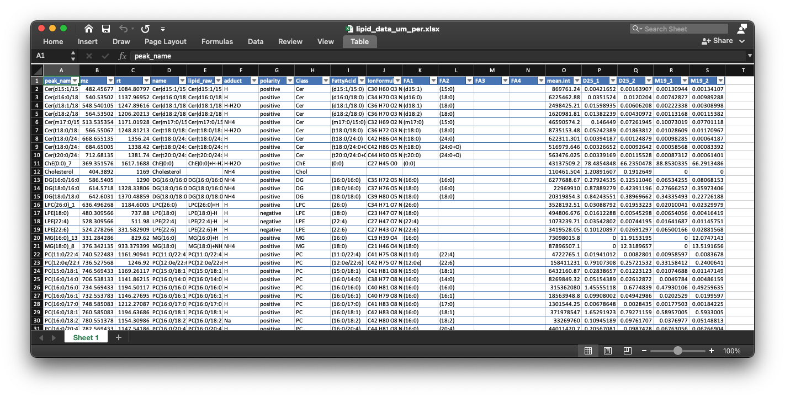

```{r, include=FALSE}
knitr::opts_chunk$set(
  collapse = TRUE,
  comment = "#>",
  out.width = "100%"
)
```

***

Then we need to output and organize some results. If you have not finished the previous step, please click here: 

[Get absolute quantification data](https://jaspershen.github.io/lipidflow/articles/absolute_quantification.html). 

***

# **Organize results**

Here we first organize the plots of lipids to different groups according to lipid class.

```{r, eval=TRUE, warning=FALSE, message=FALSE, cache=TRUE}
library(lipidflow)
library(tidyverse)
library(openxlsx)
```

***

## **Positive mode**

```{r, eval=TRUE, warning=FALSE, message=FALSE, cache=TRUE}
match_item_pos =
  list(
    "Cer" = "d18:1 (d7)-15:0 Cer",
    "ChE" = c("18:1(d7) Chol Ester", "Cholesterol (d7)"),
    "Chol" = "Cholesterol (d7)",
    "DG" = "15:0-18:1(d7) DAG",
    "LPC" = "18:1(d7) Lyso PC",
    "LPE" = "18:1(d7) Lyso PE",
    "MG" = "18:1 (d7) MG",
    "PA" = "15:0-18:1(d7) PA (Na Salt)",
    "PC" = "15:0-18:1(d7) PC",
    "PE" = "15:0-18:1(d7) PE",
    "PG" = "15:0-18:1(d7) PG (Na Salt)",
    "PI" = "15:0-18:1(d7) PI (NH4 Salt)",
    "PPE" = "C18(Plasm)-18:1(d9) PE",
    "PS" = "15:0-18:1(d7) PS (Na Salt)",
    "SM" = "d18:1-18:1(d9) SM",
    "TG" = "15:0-18:1(d7)-15:0 TAG"
  )
```

We want to organize the peak shape of lipids in `example/POS/lipid_relative_quantification/peak_shape` to different folders according to lipid class.


```{r, eval=TRUE, warning=FALSE, message=FALSE, cache=TRUE}
absolute_table <-
  readxl::read_xlsx("example/Result/lipid_data_um.xlsx")

reorganize_peak_plot(
  path = "example/POS/lipid_relative_quantification/",
  plot_dir = "peak_shape",
  absolute_table = absolute_table,
  match_item = match_item_pos
)
```

After the organization, the folder like this:


***

## **Negative mode**

```{r, eval=TRUE, warning=FALSE, message=TRUE, cache=TRUE}
match_item_neg =
  list(
    "Cer" = "d18:1 (d7)-15:0 Cer",
    "Chol" = "Cholesterol (d7)",
    "ChE" = c("18:1(d7) Chol Ester", "Cholesterol (d7)"),
    "LPC" = "18:1(d7) Lyso PC",
    "LPE" = "18:1(d7) Lyso PE",
    "PC" = "15:0-18:1(d7) PC",
    "PE" = "15:0-18:1(d7) PE",
    "PG" = "15:0-18:1(d7) PG (Na Salt)",
    "PI" = "15:0-18:1(d7) PI (NH4 Salt)",
    "PPE" = "C18(Plasm)-18:1(d9) PE",
    "PS" = "15:0-18:1(d7) PS (Na Salt)",
    "SM" = "d18:1-18:1(d9) SM"
  )
```

```{r, eval=TRUE, warning=FALSE, message=FALSE, cache=TRUE}
reorganize_peak_plot(
  path = "example/NEG/lipid_relative_quantification/",
  plot_dir = "peak_shape",
  absolute_table = absolute_table,
  match_item = match_item_neg
)
```
***

# **Output some results**

```{r, eval=TRUE, warning=FALSE, message=FALSE, cache=TRUE}
output_result(path = "example",
              match_item_pos = match_item_pos,
              match_item_neg = match_item_neg)
```
***

# **The final results**

Finally, all the results are in `example/Result`. 


***

## **1. `IS_info_table.xlsx`**

This table is the information of internal standards in positive and negative mode, respectively.


***

## **2. `lipid_data_class_ug_ml.xlsx`**

This table is the absolute quantification table for each sample in lipid class level (ug/ml).  


***

## **3. `lipid_data_class_um_per.xlsx`**

This table is the absolute quantification table for each sample in lipid class level (um), and the values were calculated as value/sum(values).


***

## **4. `lipid_data_class_um.xlsx`**

This table is the absolute quantification table for each sample in lipid class level (um).  


***

## **5. `lipid_data_ug_ml.xlsx`**

This is the absolute quantification for each lipid in each sample. The unit is ug/ml. 


***

## **6. `lipid_data_um_per.xlsx`**

This is the absolute quantification for each lipid in each sample. The unit is ug/ml. And the values were calculated as value/sum(values).


***

## **7. `lipid_data_um.xlsx`**

This is the absolute quantification for each lipid in each sample. The unit is um. 


***

## **8. `plot_ug.pdf` and `plot_um.pdf`**

These two figures are percentage for each lipid class in each sample in ug/ml and um level.


***

## **9. `class_plot`**

This folder contains the intensity plot in class level fro each lipid class.

One example is like below figure shows:


***

## **10. `intensity_plot`**

This folder contains the intensity plot for each lipid.


This is an example: the top panel is the relative intensity plot for the internal standard. The middle panel is the relative intensity plot for this lipid, and the bottom panel is the absolute intensity plot for this lipid.


***

## **Next step**

Next we need to check the results and rerun to get more accurate results:

[Output results](https://jaspershen.github.io/lipidflow/articles/output_result.html)