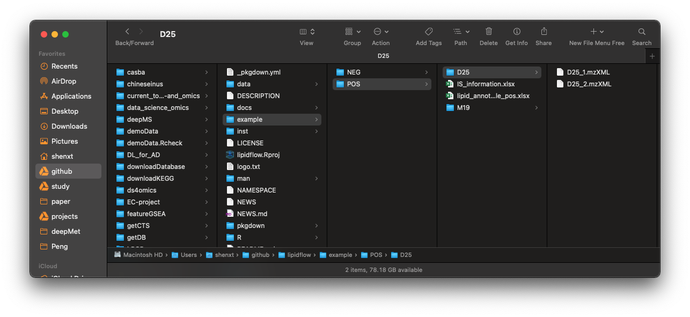

```{r, include=FALSE}
knitr::opts_chunk$set(
  collapse = TRUE,
  comment = "#>",
  out.width = "100%"
)
```

***

# **Data organization**

We need three types of data for `lipidflow`. 

* 1. Raw data of all the sample. 

* 2. Information of internal standards in samples.

* 3. Lipid annotation table from other tools (lipidSearch).

***

## **1. Convert raw data to mzXML data**

The raw lipidomics data should be converted to mzXML format files using [ProteoWizard software](http://proteowizard.sourceforge.net/). The parameter setting should be set as below figure shows:


***

## **2. Internal standard information**

To do absolute quantification, we need to provide the information of internal standard in the samples. The data should be "xlsx" format, and like the below figures shows:


This is a example of internal standards in our demo data. The first column is "name" (name of internal standards), the second column is "exact.mass" (exact mass of internal standards), the third column is "formula", the fourth column is "ug_ml" (concentration) and the fifth column is "um" (concentration). 

And then put the internal standard information in "POS" and "NEG" folders, respectively.

***

## **3. Lipid identification information**

The lipid identification table can be from any other software, for example, here we use the `lipidSearch` software from [ThermoFisher](https://www.thermofisher.com/order/catalog/product/IQLAAEGABSFAPCMBFK?us&en#/IQLAAEGABSFAPCMBFK?us&en), and then put the lipid identification table (xlsx format) for positive and negative mode in "POS" and "NEG" folder respectively. 

The lipid identification table from `lipidSearch` is like the below figure shows:


***

## **Place data into a folder**

After all the data have been prepared, then create a folder, for example: "example". And then create "POS" and "NEG" folders in it, then put all the mzMXL data, information of internal standard and lipid identification table into the folders according to groups like the below figure shows:


In our demo data, we have two groups, `D25` and `M19`, and each group has two repeats. And the information of internal standards is `IS_information.xlsx`, and placed in `POS` and `NEG` folder, respectively. The lipid annotation tables are `lipid_annotation_table_pos.xlsx` and `lipid_annotation_table_neg.xlsx`, then place them in `POS` and `NEG` folders, respectively.

***


# **Steps to get absolute quantification data of lipids**

***

## **Step 1: Get retention time of internal standards**

The step 1 is to get the retention time of internal standards. 

Please click [here for detailed instruction](https://jaspershen.github.io/lipidflow/articles/get_is_retention_time.html).

***

## **Step 2: Get relative quantification data**

The step 2 is to get the relative quantification data of internal standards and lipids. 

Please click [here for detailed instruction](https://jaspershen.github.io/lipidflow/articles/is_relative_quantification.html).

***

## **Step 3: Get absolute quantification data**

The step 3 is to get the absolute quantification data of lipids. 

Please click [here for detailed instruction](https://jaspershen.github.io/lipidflow/articles/absolute_quantification.html).

***

## **Step 4: Output and organize results**

The step 4 is to output and organize results.

Please click [here for detailed instruction](https://jaspershen.github.io/lipidflow/articles/output_result.html).

***

# **One function to finish all steps**

We can also use one function (`get_lipid_absolute_quantification()`) to finish all previous steps.

Please click [here to learn how to use](https://jaspershen.github.io/lipidflow/articles/one_step_of_lipidflow.html).
