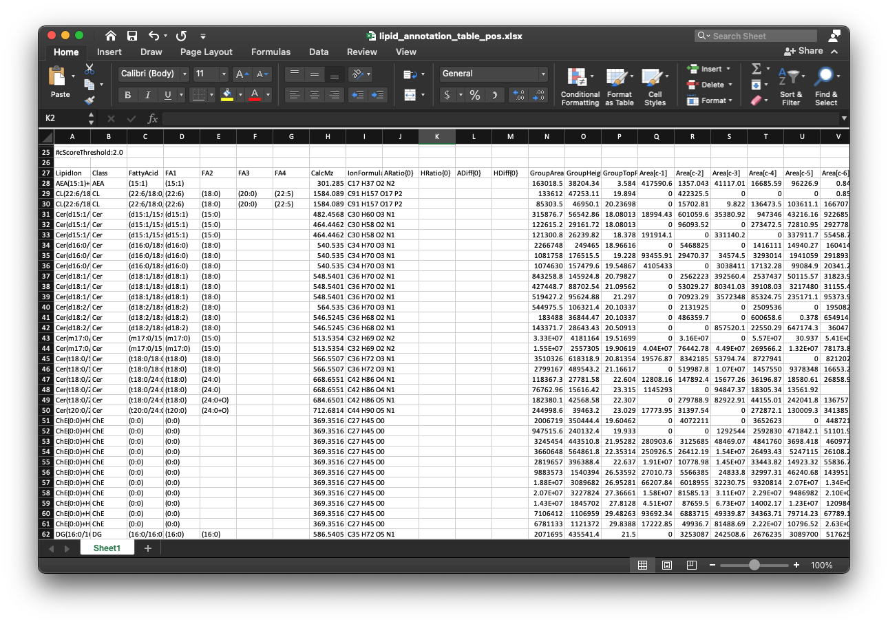

```{r, include=FALSE}
knitr::opts_chunk$set(
  collapse = TRUE,
  comment = "#>",
  out.width = "100%"
)
```

***

# **Data organization**

## **Convert raw data to mzXML data**

The raw lipidomics data should be transferred to mzXML format files using [ProteoWizard software](http://proteowizard.sourceforge.net/). The parameter setting should be set as below figure shows:


## **Place mzXML data into a folder**

Then create a folder, and create "POS" and "NEG" folders in it, then put all the mzMXL data into the folders according to groups like the below figure shows:


## **Internal standard information**

To do absolute quantification, we need to provide the information of internal standard in the samples. The data should be "xlsx" format, and like the below figures shows:


The first column is "name" (name of internal standards), the second column is "exact.mass" (exact mass of internal standards), the third column is "formula", the fourth column is "ug_ml" and the fifth column is "um". 


And then put the internal standard information in "POS" and "NEG" folder respectively.

## **Lipid identification information**

The lipid identification table can be from any other software, for example, here we use the `lipidSearch` software from [Thermo](https://www.thermofisher.com/order/catalog/product/IQLAAEGABSFAPCMBFK?us&en#/IQLAAEGABSFAPCMBFK?us&en), and then put the lipid identification table (xlsx format) for positive and negative mode in "POS" and "NEG" folder respectively. 

The lipid identification table from `lipidSearch` is like the below figure shows:



# **Run `get_lipid_absolute_quantification()`**

Then we can run `get_lipid_absolute_quantification()` function to get the absolute quantification table of lipids.

```{r, eval = FALSE, warning = FALSE}
get_lipid_absolute_quantification(
  path = path,
  is_info_name_pos = is_info_name_pos,
  is_info_name_neg = is_info_name_neg,
  use_manual_is_info = use_manual_is_info,
  lipid_annotation_table_pos = lipid_annotation_table_pos,
  lipid_annotation_table_neg = lipid_annotation_table_neg,
  chol_rt = chol_rt,
  output_integrate = output_integrate,
  forced_targeted_peak_table_name = forced_targeted_peak_table_name,
  fit.gaussian = fit.gaussian,
  integrate_xcms = integrate_xcms,
  output_eic = output_eic,
  ppm = ppm,
  rt.tolerance = rt.tolerance,
  threads = threads,
  rerun = rerun,
  which_group_for_rt_confirm = which_group_for_rt_confirm,
  match_item_pos = match_item_pos,
  match_item_neg = match_item_neg
)
```

All the parameters:

* **path**: working directory.

* **is_info_name_pos & is_info_name_neg**: the names of internal standard information (xlsx format), they should be in "POS" and "NEG" folders, respectively.

* **use_manual_is_info**: If you have know the adduct and retention time of the internal standards, you can put them in the internal standard information and then set this as TRUE. The example of `use_manual_is_info` (xlsx format) is like below figure shows:


* **lipid_annotation_table_pos & lipid_annotation_table_neg**: lipid identification tables from other software (xlsx format), they should be in "POS" and "NEG" folder, respectively.

* **output_eic**: Output EIC or not.

* **ppm**: Peak detection ppm.

* **rt.tolerance**: Peak detection RT tolerance.

* **threads**: Number of cores.

* **rerun**: Rerun or not.

* **which_group_for_rt_confirm**: From which group to find the retention times of all the internal standards.

* **match_item_pos & match_item_neg**: The lipid group and internal standard matching table. It is a list. For example:   

```{r, eval=FALSE, echo=TRUE}
list(
    "Cer" = "d18:1 (d7)-15:0 Cer",
    "ChE" = c("18:1(d7) Chol Ester", "Cholesterol (d7)"),
    "Chol" = "Cholesterol (d7)",
    "DG" = "15:0-18:1(d7) DAG",
    "LPC" = "18:1(d7) Lyso PC",
    "LPE" = "18:1(d7) Lyso PE",
    "MG" = "18:1 (d7) MG",
    "PA" = "15:0-18:1(d7) PA (Na Salt)",
    "PC" = "15:0-18:1(d7) PC",
    "PE" = "15:0-18:1(d7) PE",
    "PG" = "15:0-18:1(d7) PG (Na Salt)",
    "PI" = "15:0-18:1(d7) PI (NH4 Salt)",
    "PPE" = "C18(Plasm)-18:1(d9) PE",
    "PS" = "15:0-18:1(d7) PS (Na Salt)",
    "SM" = "d18:1-18:1(d9) SM",
    "TG" = "15:0-18:1(d7)-15:0 TAG"
  )
```

Next we will use the demo data in `lipidflow` to show the all the steps of `lipidflow`, please click here: [example of lipidflow](https://jaspershen.github.io/lipidflow/articles/example_lipid_absolute_quantification.html)
